# Applitools Eyes - Detailed Guide

## 🤖 **What is Applitools Eyes?**

Applitools Eyes is an AI-powered visual testing platform that uses computer vision and machine learning to automatically detect visual regressions in web applications.

## 🧠 **How does Applitools Eyes work?**

### **1. Visual Testing Process**

```mermaid
graph TD
    A[Open page] --> B[Create screenshot]
    B --> C{Baseline exists?}
    C -->|No| D[Create baseline]
    C -->|Yes| E[Compare with baseline]
    D --> F[Save baseline]
    E --> G[AI difference analysis]
    G --> H{Differences detected?}
    H -->|No| I[✅ Test passed]
    H -->|Yes| J[❌ Test failed]
    J --> K[Create diff image]
    K --> L[Detailed report]
```



### **2. AI Image Analysis**

Applitools uses several levels of AI analysis:

#### **Level 1: Pixel-level comparison**
```python
# Basic pixel comparison
def pixel_comparison(baseline, current):
    diff = cv2.absdiff(baseline, current)
    return np.sum(diff) > threshold
```

#### **Level 2: Layout analysis**
```python
# Page structure analysis
def layout_analysis(baseline, current):
    # Element detection
    baseline_elements = detect_elements(baseline)
    current_elements = detect_elements(current)

    # Compare positions and sizes
    return compare_layouts(baseline_elements, current_elements)
```

#### **Level 3: Content analysis**
```python
# Content analysis
def content_analysis(baseline, current):
    # OCR for text extraction
    baseline_text = extract_text(baseline)
    current_text = extract_text(current)

    # Text comparison
    return compare_text_content(baseline_text, current_text)
```

#### **Level 4: Semantic analysis**
```python
# Semantic analysis
def semantic_analysis(baseline, current):
    # Understanding change context
    changes = detect_semantic_changes(baseline, current)

    # Classify change importance
    return classify_changes(changes)
```

## 🔧 **Practical Usage Examples**

### **Example 1: Basic Visual Testing**

```python
from src.core.utils.visual_testing import VisualTester

class TestHomePageVisual:
    def test_home_page_layout(self, driver):
        """Test visual layout of home page"""

        # Initialize visual tester
        visual_tester = VisualTester()

        # Open page
        driver.get("https://automationexercise.com/")

        # Visual check
        result = visual_tester.check_page_layout("home_page", driver)

        # Analyze result
        if result['status'] == 'passed':
            print("✅ No visual differences detected")
        elif result['status'] == 'failed':
            print("❌ Visual differences detected!")
            print(f"📷 Diff image: {result.get('diff_image')}")
            print(f"📊 Statistics: {result.get('differences')}")
```

### **Example 2: Checking specific areas**

```python
def test_header_visual_check(self, driver):
    """Test visual check of header area"""

    visual_tester = VisualTester()
    driver.get("https://automationexercise.com/")

    # Find header element
    header = driver.find_element(By.CSS_SELECTOR, ".header-middle")

    # Define area for check
    region = (
        header.location['x'],
        header.location['y'],
        header.size['width'],
        header.size['height']
    )

    # Check only header
    result = visual_tester.check_page_layout(
        "header_check",
        driver,
        region=region
    )

    assert result['status'] in ['passed', 'failed', 'baseline_created']
```

### **Example 3: Responsive testing**

```python
def test_responsive_design(self, driver):
    """Test responsive design on different devices"""

    visual_tester = VisualTester()

    # Test different screen sizes
    screen_sizes = [
        (1920, 1080, "desktop"),
        (1366, 768, "laptop"),
        (768, 1024, "tablet"),
        (375, 667, "mobile")
    ]

    for width, height, device in screen_sizes:
        driver.set_window_size(width, height)
        driver.refresh()

        result = visual_tester.check_page_layout(
            f"home_page_{device}",
            driver
        )

        print(f"📱 {device}: {result['status']}")
```

## 🎯 **AI Capabilities of Applitools**

### **1. Smart change ignoring**

Applitools AI automatically ignores:

```python
# Ignored changes
ignored_changes = [
    "Time and date",           # Dynamic content
    "Animations",               # CSS animations
    "Micro-color changes", # Minor color differences
    "Fonts",                 # Font rendering differences
    "Shadows and borders",         # Micro-changes in CSS
]
```

### **2. Critical change detection**

AI focuses on important changes:

```python
# Critical changes
critical_changes = [
    "Element disappearance",     # display: none
    "Position change",          # position changes
    "Size change",          # size changes
    "Background color change",       # background-color
    "Text change",           # content changes
    "Addition/removal of elements" # structural changes
]
```

### **3. Contextual analysis**

```python
def context_analysis(baseline, current):
    """Contextual analysis of changes"""

    # Analyze change context
    context = {
        "page_type": detect_page_type(current),
        "user_flow": detect_user_flow(current),
        "element_importance": analyze_element_importance(current),
        "change_impact": assess_change_impact(baseline, current)
    }

    return context
```

## 📊 **Detailed Reporting**

### **1. Report structure**

```python
{
    "status": "failed",
    "differences": {
        "total_differences": 5,
        "difference_percentage": 2.3,
        "critical_changes": 2,
        "minor_changes": 3,
        "ignored_changes": 1
    },
    "diff_image": "/path/to/diff.png",
    "recommendations": [
        "Check for changes in header",
        "Ensure all elements are displayed",
        "Check responsive design"
    ],
    "metadata": {
        "browser": "Chrome",
        "viewport": "1920x1080",
        "timestamp": "2024-01-15T10:30:00Z",
        "page_url": "https://example.com"
    }
}
```

### **2. Visualizing differences**

```python
def visualize_differences(baseline_path, current_path, diff_path):
    """Creating a visualization of differences"""

    # Load images
    baseline = cv2.imread(baseline_path)
    current = cv2.imread(current_path)

    # Calculate differences
    diff = cv2.absdiff(baseline, current)

    # Apply color map for differences
    diff_colored = cv2.applyColorMap(diff, cv2.COLORMAP_HOT)

    # Save result
    cv2.imwrite(diff_path, diff_colored)
```

## 🔄 **Integration with CI/CD**

### **1. GitHub Actions integration**

```yaml
name: Visual Testing
on: [push, pull_request]

jobs:
  visual-test:
    runs-on: ubuntu-latest
    steps:
      - uses: actions/checkout@v4

      - name: Setup Python
        uses: actions/setup-python@v4
        with:
          python-version: '3.12'

      - name: Install dependencies
        run: |
          pip install -r requirements.txt
          playwright install

      - name: Run visual tests
        env:
          APPLITOOLS_API_KEY: ${{ secrets.APPLITOOLS_API_KEY }}
        run: |
          pytest tests/visual/ -v --html=reports/visual_report.html

      - name: Upload visual report
        uses: actions/upload-artifact@v4
        with:
          name: visual-test-report
          path: reports/
```

### **2. Automatic baseline update**

```python
def auto_update_baseline(test_result):
    """Automatic baseline update when expected changes are detected"""

    if test_result['status'] == 'failed':
        # Check if the change is expected
        if is_expected_change(test_result['differences']):
            update_baseline(test_result['current_image'])
            print("✅ Baseline updated for expected changes")
        else:
            print("❌ Unexpected changes detected")
            raise AssertionError("Visual differences require manual analysis")
```

## 🎨 **Sensitivity Configuration**

### **1. Sensitivity levels**

```python
# Applitools sensitivity configuration
applitools_config = {
    "exact": {
        "description": "Exact pixel comparison",
        "use_case": "Critical UI elements",
        "threshold": 0
    },
    "strict": {
        "description": "Strict comparison with small tolerances",
        "use_case": "Main interface elements",
        "threshold": 0.1
    },
    "content": {
        "description": "Content comparison",
        "use_case": "Text content",
        "threshold": 0.5
    },
    "layout": {
        "description": "Only structure comparison",
        "use_case": "Page layout",
        "threshold": 0.8
    }
}
```

### **2. Code configuration**

```python
def configure_applitools_sensitivity(eyes, sensitivity_level):
    """Configure Applitools sensitivity"""

    if sensitivity_level == "exact":
        eyes.match_level = MatchLevel.EXACT
    elif sensitivity_level == "strict":
        eyes.match_level = MatchLevel.STRICT
    elif sensitivity_level == "content":
        eyes.match_level = MatchLevel.CONTENT
    elif sensitivity_level == "layout":
        eyes.match_level = MatchLevel.LAYOUT
```

## 🚀 **Best Practices**

### **1. Test organization**

```python
# Visual test structure
visual_tests_structure = {
    "smoke": [
        "home_page_layout",
        "header_visibility",
        "footer_visibility"
    ],
    "regression": [
        "all_pages_layout",
        "responsive_design",
        "interaction_states"
    ],
    "critical": [
        "checkout_flow",
        "user_registration",
        "payment_forms"
    ]
}
```

### **2. Baseline management**

```python
def manage_baselines():
    """Managing baseline images"""

    baseline_strategy = {
        "auto_update": False,  # Automatic update
        "manual_review": True, # Manual review of changes
        "version_control": True, # Versioning baseline
        "cleanup_old": True,   # Cleaning up old baseline
        "retention_days": 30   # Retention 30 days
    }

    return baseline_strategy
```

### **3. Performance optimization**

```python
def optimize_visual_testing():
    """Optimizing visual testing"""

    optimizations = {
        "parallel_execution": True,    # Parallel execution
        "smart_cropping": True,        # Smart cropping
        "caching": True,               # Caching baseline
        "compression": True,           # Image compression
        "selective_testing": True      # Selective testing
    }

    return optimizations
```

## 📈 **Metrics and Monitoring**

### **1. Key metrics**

```python
visual_testing_metrics = {
    "test_execution_time": "Test execution time",
    "baseline_creation_time": "Baseline creation time",
    "comparison_accuracy": "Comparison accuracy",
    "false_positive_rate": "False positive rate",
    "false_negative_rate": "False negative rate",
    "ai_confidence_score": "AI confidence score"
}
```

### **2. Performance monitoring**

```python
def monitor_visual_testing_performance():
    """Monitoring visual testing performance"""

    performance_metrics = {
        "average_test_time": calculate_average_test_time(),
        "baseline_size": calculate_baseline_size(),
        "storage_usage": calculate_storage_usage(),
        "api_response_time": measure_api_response_time(),
        "error_rate": calculate_error_rate()
    }

    return performance_metrics
```

## 🎯 **Conclusion**

Applitools Eyes provides a powerful AI-powered approach to visual testing:

### **Advantages:**
- ✅ **AI analysis** - Smart difference detection
- ✅ **Automation** - Minimal human involvement
- ✅ **Accuracy** - Low false positive rate
- ✅ **Scalability** - Works with any number of pages
- ✅ **Integration** - Easy integration with CI/CD

### **Applications:**
- 🎨 **UI testing** - Checking visual layout
- 📱 **Responsive testing** - Adapting to different devices
- 🔄 **Regression testing** - Detecting unwanted changes
- 🚀 **CI/CD integration** - Automated testing in the pipeline

Applitools Eyes makes visual testing fast, accurate, and reliable! 🚀
